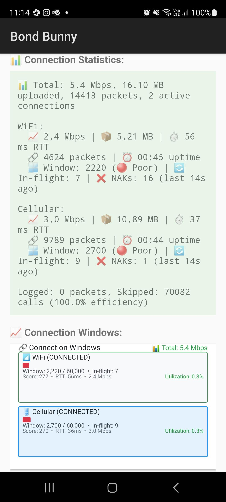

# Bond Bunny. SRT to SRTLA Bonding App for Android

This is Android app that allows listening on local port for SRT stream and then forwarding SRT packets via multiple connections, such as cellular, Wi-Fi and Ethernet, to remote SRTLA server like [Belabox Cloud](https://belabox.net/). This process is also known as bonding.

This is compatible with any apps that can stream SRT and it essentially extends them with bonding on the same device.

Android implementation of [SRTLA](https://github.com/BELABOX/srtla).

Share ideas or report issues in Discord https://discord.gg/2UzEkU2AJW or create Git issues.

## Apps that can work together

See the [demo video on YouTube](https://www.youtube.com/watch?v=_zlWsQYxrE4).

- [MediaSrvr](https://github.com/dimadesu/MediaSrvr) - Runs RTMP server on Android phone. You can publish RTMP stream to it from an action camera, for example.
- [LifeStreamer](https://github.com/dimadesu/LifeStreamer) - Can use RTMP as source: playback RTMP stream from server and restream it as SRT with great dynamic bitrate.
- Bond Bunny - You can use LifeStreamer to publish SRT stream into Bond Bunny.

## Installation Instructions

Not sure yet when app will be ready for publishing to Google Play store if ever.

For now I'll be publishing .apk files periodically via GitHub releases on this repo.

- Open https://github.com/dimadesu/bond-bunny/releases on the device that you want to install it on
- Download .apk file
- Install
- Enjoy!

## Apps that can stream SRT on Android
- [LifeStreamer](https://github.com/dimadesu/LifeStreamer)
- IRL Pro (free)
- Larix Broadcaster (subscription)
- Larix Screencaster (subscription)
- Can do HDMI/USB/UVC as input:
  - USB Camera (free with ads) / USB Camera Pro (one-time payment to remove ads)
  - CameraFi (free version with ads or subscription)
